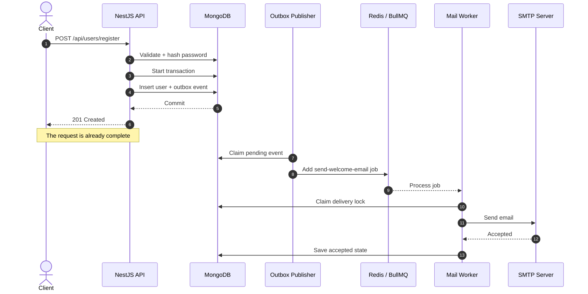
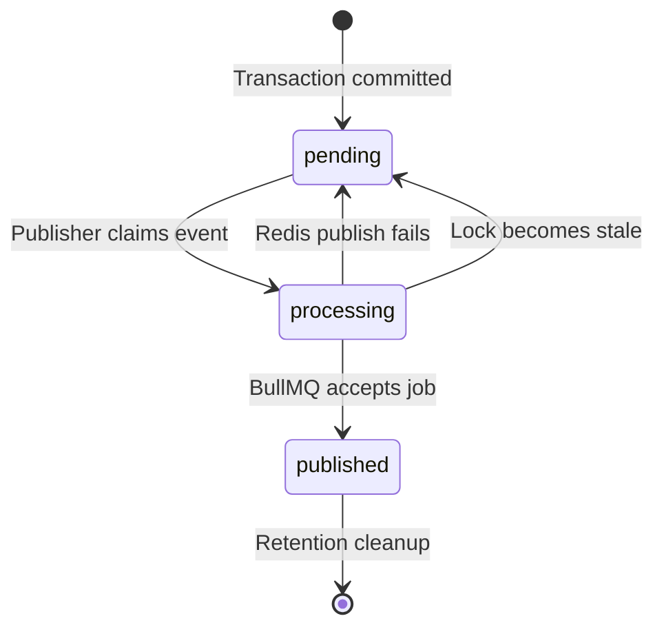
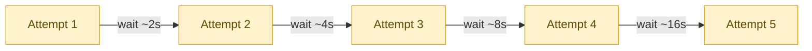
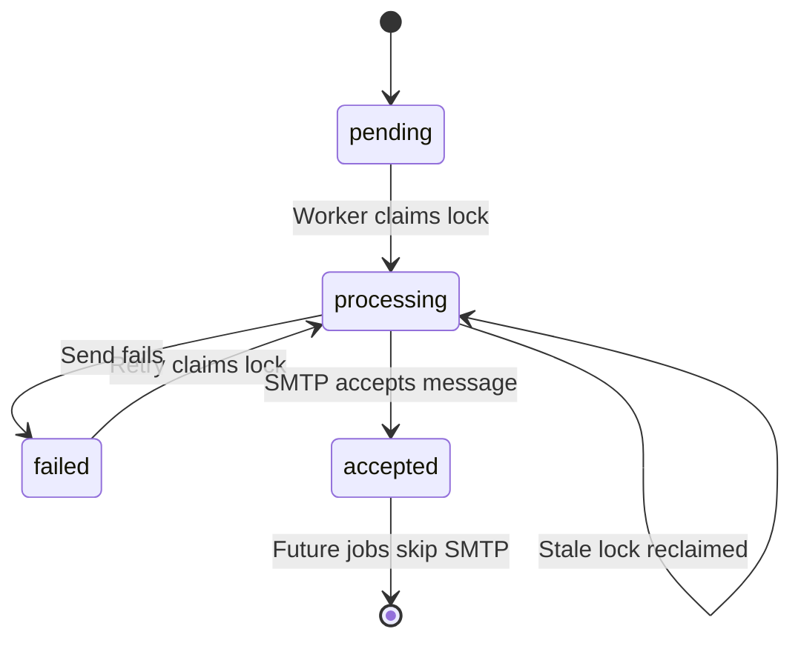

# NestJS Background Email Jobs

[](https://nestjs.com/)
[](https://www.mongodb.com/)
[](https://redis.io/)
[](https://bullmq.io/)
[](https://nodejs.org/)
[](https://docs.docker.com/compose/)

A practical NestJS example that sends welcome emails in the background with
MongoDB, BullMQ, Redis, Nodemailer, and a real SMTP server.

The main idea is simple: registration should not wait for an email provider.
The API saves the user, records an event, and responds. A separate worker picks
up the email job and handles SMTP in the background.

Along the way, the project also deals with the less glamorous—but important—
parts: retries, duplicate processing, worker crashes, queue retention, and
durable delivery state.

## What happens when someone registers?

```mermaid
flowchart LR
    Client([Client]) -->|POST /api/users/register| API[NestJS API]

    subgraph request["Request path"]
        API --> Validate[Validate input]
        Validate --> Hash[Hash password]
        Hash --> Transaction{{MongoDB transaction}}
        Transaction --> User[(Create user)]
        Transaction --> Event[(Create outbox event)]
    end

    subgraph background["Background path"]
        Event -. every 5 seconds .-> Publisher[Outbox publisher]
        Publisher --> Queue[[Redis / BullMQ]]
        Queue --> Worker[NestJS mail worker]
        Worker --> Claim[(Claim delivery)]
        Claim --> SMTP[SMTP server]
        SMTP --> Result[(Save delivery result)]
    end

    User -->|201 Created — no SMTP wait| Client

    classDef api fill:#e0234e,color:#fff,stroke:#b51b3e
    classDef data fill:#47a248,color:#fff,stroke:#367c37
    classDef queue fill:#dc382d,color:#fff,stroke:#a52a20
    classDef worker fill:#2496ed,color:#fff,stroke:#1874b5
    class API api
    class User,Event,Claim,Result data
    class Queue queue
    class Worker worker
```



In short:

1. The request is validated.
2. The password is hashed with bcrypt.
3. The user and outbox event are written in one MongoDB transaction.
4. The API returns the new user immediately.
5. The outbox publisher creates a BullMQ job.
6. The worker claims the delivery and sends the email through SMTP.
7. MongoDB keeps the final delivery state.

### Request and worker timeline

The HTTP response and email delivery are intentionally two separate timelines:



## Stack

| Technology         | What it does here                                           |
| ------------------ | ----------------------------------------------------------- |
| NestJS             | API, dependency injection, cron jobs, and standalone worker |
| MongoDB + Mongoose | Users, outbox events, transactions, delivery records        |
| Redis + BullMQ     | Background queue, retries, backoff, and job history         |
| Nodemailer         | SMTP transport                                              |
| bcrypt             | Password hashing                                            |
| class-validator    | Request validation                                          |
| Swagger            | Interactive API docs                                        |
| Docker Compose     | Local infrastructure and production services                |

## Why are the API and worker separate?

The API and worker use the same codebase, but they are different processes:

```text
API:     src/main.ts
Worker:  src/worker.ts
```

The API opens an HTTP server. The worker starts a Nest application context
without opening a port.

That means:

- SMTP latency does not slow down registration;
- jobs stay in Redis while the worker is offline;
- the worker can restart without stopping the API;
- more workers can be added without adding more API instances.

## Project structure

```text
src/
├── main.ts
├── worker.ts
├── app.module.ts
├── worker-app.module.ts
│
├── config/
│   └── environment.ts
│
├── infrastructure/
│   └── database/
│       └── database.module.ts
│
├── features/
│   ├── users/
│   │   ├── dtos/user-register.dto.ts
│   │   ├── user.schema.ts
│   │   ├── users.controller.ts
│   │   └── users.service.ts
│   ├── outbox/
│   │   ├── outbox.schema.ts
│   │   └── outbox.publisher.ts
│   └── operations/
│       ├── operations.controller.ts
│       └── operations.service.ts
│
└── modules/cache/
    ├── queue/
    │   └── queue.module.ts
    └── mail/
        ├── delivery/
        │   ├── email-delivery.schema.ts
        │   └── email-delivery.service.ts
        ├── jobs/
        │   ├── mail-job.constants.ts
        │   ├── mail-job.types.ts
        │   ├── mail-job.producer.ts
        │   └── mail-job.processor.ts
        └── services/
            └── mail.service.ts
```

## Requirements

- Node.js 22+
- pnpm 10.13.1
- Docker with Docker Compose
- Access to an SMTP server

The pnpm version is pinned in `package.json`. If needed:

```bash
corepack enable
```

## SMTP setup

For a typical STARTTLS connection:

```dotenv
SMTP_HOST=smtp.example.com
SMTP_PORT=587
SMTP_SECURE=false
SMTP_USER=your-user
SMTP_PASSWORD=your-password
MAIL_FROM_NAME=Nest Mail Jobs
MAIL_FROM_ADDRESS=no-reply@your-domain.com
```

For direct TLS, usually on port 465:

```dotenv
SMTP_PORT=465
SMTP_SECURE=true
```

The worker verifies the SMTP connection when it starts. It also uses a pooled
transport:

- up to 5 connections;
- up to 100 messages per connection;
- 10-second connection and greeting timeouts;
- 30-second socket timeout.

The email includes both plain text and HTML. Names are HTML-escaped before
being placed in the template.

Each message also gets deterministic metadata:

```text
Message-ID: <welcome-USER_ID@sender-domain>
X-User-ID: USER_ID
X-Delivery-Key: welcome-USER_ID
```

## Run locally

Install dependencies:

```bash
pnpm install
```

Start MongoDB and Redis:

```bash
docker compose up -d --wait
docker compose ps
```

Compose starts MongoDB as replica set `rs0`, because MongoDB transactions need
a replica set.

Start the API:

```bash
pnpm start:dev
```

Open another terminal and start the worker:

```bash
pnpm start:worker:dev
```

Swagger is available at:

```text
http://localhost:3000/api/docs/
```

## Register a user

```http
POST /api/users/register
Content-Type: application/json
```

```json
{
  "name": "Can",
  "email": "squalcan@gmail.com",
  "password": "yourprivatepasswordhardtofind"
}
```

Example response:

```json
{
  "id": "688e8af3d8a28e6b41f067d4",
  "name": "Can",
  "email": "squalcan@gmail.com",
  "createdAt": "2026-07-20T13:34:41.198Z"
}
```

The email is trimmed and converted to lowercase. Registering the same address
again returns `409 Conflict`.

The password never enters the queue. MongoDB stores only `passwordHash`, and
that field is excluded from normal Mongoose queries by default.

## The outbox, without the ceremony

Saving a user and then calling Redis directly leaves a small failure window:
the user may be committed just before Redis becomes unavailable.

This project avoids that by storing the user and a `user.registered` event in
the same MongoDB transaction:

```text
MongoDB transaction
├── users
└── outbox_events
```

The outbox publisher runs every five seconds and:

1. claims the oldest `pending` event;
2. moves it to `processing`;
3. adds a BullMQ job;
4. marks it as `published`.

If Redis publishing fails, the event goes back to `pending` and the error is
stored in `lastError`.

An event stuck in `processing` for more than five minutes can be claimed
again. One publisher run handles up to 100 events.

Published events are cleaned daily at 03:00 UTC after
`OUTBOX_RETENTION_DAYS`.

### Outbox states

| State        | Meaning                 |
| ------------ | ----------------------- |
| `pending`    | Waiting for Redis       |
| `processing` | Claimed by a publisher  |
| `published`  | BullMQ accepted the job |



## BullMQ jobs

Queue:

```text
mail-queue
```

Job:

```text
send-welcome-email
```

The payload contains only what the email needs:

```json
{
  "schemaVersion": 1,
  "eventId": "0896ef07-d661-490a-bfdd-be3ed7bd6f76",
  "userId": "688e8af3d8a28e6b41f067d4",
  "email": "burhan@example.com",
  "name": "Burhan",
  "correlationId": "598a3293-02fd-43de-8c88-b44821af2719",
  "createdAt": "2026-07-20T13:34:41.198Z"
}
```

No passwords, hashes, tokens, sessions, or full user documents are placed in
Redis.

Unsupported job names and payload schema versions fail with
`UnrecoverableError`.

### Retry settings

```text
attempts: 5
backoff: exponential
initial delay: 2 seconds
jitter: 0.2
```

So retries happen at roughly increasing intervals:



Jitter prevents many failed jobs from retrying at the exact same moment.

One worker handles up to 5 jobs concurrently, with a BullMQ limit of 20 jobs
per second.

Completed jobs stay in Redis for up to 24 hours or 10,000 records. Failed jobs
stay for up to 7 days or 50,000 records.

## Delivery locking and duplicate protection

BullMQ is an at-least-once system, so a job may run again after a retry or
worker interruption. The project keeps a durable delivery record in MongoDB
to reduce duplicate sends.

For welcome emails:

```text
jobId:       welcome-EVENT_ID
deliveryKey: welcome-USER_ID
messageId:   <welcome-USER_ID@sender-domain>
```

Before calling SMTP, the worker atomically claims the delivery.

It can claim a record when it is:

- `pending`;
- `failed`;
- `processing` with a lock older than five minutes.

If another worker has a fresh lock, the job throws a normal error and follows
the BullMQ retry policy.

If the delivery is already `accepted` or `delivered`, the worker returns the
saved result and skips SMTP.

The normal state flow is:



After SMTP accepts the message, MongoDB stores the provider message ID and
acceptance time. If sending fails, the record becomes `failed`, its lock is
removed, and `lastError` is saved.

`accepted` means the SMTP server accepted the message. It does not necessarily
mean the email reached the inbox.

## Operational endpoints

All routes use the `/api` prefix.

### Basic health

```http
GET /api/health
```

```json
{
  "status": "ok"
}
```

### MongoDB and Redis readiness

```http
GET /api/health/ready
```

```json
{
  "status": "ok",
  "mongo": "up",
  "redis": "up"
}
```

### Queue and persistence counters

```http
GET /api/operations/metrics
```

```json
{
  "queue": {
    "waiting": 3,
    "active": 1,
    "completed": 25,
    "failed": 2,
    "delayed": 1,
    "paused": 0
  },
  "outbox": {
    "pending": 0,
    "processing": 0
  },
  "deliveries": {
    "failed": 2,
    "processing": 1
  }
}
```

### BullMQ job details

```http
GET /api/mail/jobs/:jobId
```

This returns the job state, progress, attempts, failure reason, result, and
timestamps. BullMQ history is temporary, so old removed jobs return `404`.

### Durable delivery details

```http
GET /api/mail/deliveries/:deliveryKey
```

Example:

```text
GET /api/mail/deliveries/welcome-688e8af3d8a28e6b41f067d4
```

This reads the MongoDB delivery record, including status, attempts, provider
message ID, acceptance time, and last error.

## MongoDB collections

| Collection         | Main purpose                          |
| ------------------ | ------------------------------------- |
| `users`            | User profile and password hash        |
| `outbox_events`    | Events waiting to reach BullMQ        |
| `email_deliveries` | Durable email state and delivery lock |

Useful unique keys:

```text
users.email
outbox_events.eventId
email_deliveries.deliveryKey
```

## Logs

The worker logs structured events:

```text
mail_job.active
mail_job.completed
mail_job.failed
mail_job.stalled
mail_worker.error
```

Logs include useful context such as queue, job ID, user ID, correlation ID,
attempt count, and error details.

The outbox publisher logs `outbox.publish_failed` when Redis publishing fails.
Passwords and password hashes are not part of queue payloads or worker logs.

## Production with Docker

The multi-stage `Dockerfile`:

1. installs the frozen pnpm lockfile;
2. builds the NestJS application;
3. removes development dependencies;
4. creates a Node.js 22 Alpine runtime image;
5. runs as the non-root `node` user.

Build it:

```bash
docker build -t nest-mail-jobs:latest .
```

Start the production profile:

```bash
docker compose --profile production up -d --build
```

That starts MongoDB, Redis, API, and worker. The API waits for healthy MongoDB
and Redis; the worker waits for the API health check.

Check status:

```bash
docker compose --profile production ps
```

Follow logs:

```bash
docker compose --profile production logs -f api
docker compose --profile production logs -f worker
```

Stop everything:

```bash
docker compose --profile production down
```

Named MongoDB and Redis volumes remain after the containers stop.

### Scale workers

```bash
docker compose --profile production up -d --scale worker=3
```

Each worker has concurrency `5`, while MongoDB delivery locking prevents two
workers from successfully claiming the same fresh delivery at once.

Both API and worker enable NestJS shutdown hooks, so normal termination signals
trigger framework cleanup.

### Swagger

```text
http://localhost:3000/api/docs/
```

### Dev:

I built this project for anyone who wants to understand how a production-ready background job system actually works beyond the basic bull sh*t “add a job and process it” examples.

### Contributing

Contributions are welcome! If you find a bug, have an idea, or want to improve the project, feel free to open an issue or submit a pull request.
